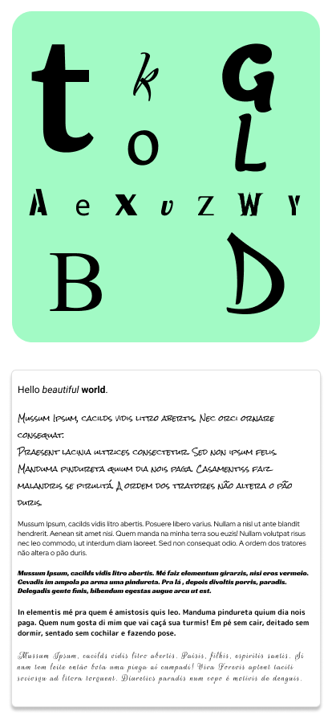
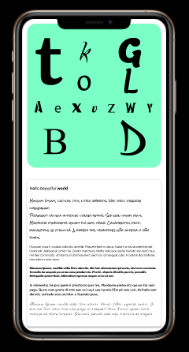

# text_widget

A sample use of Text Widget. This sample will cover the basic use of a Text Widget and some other features.

## What is this for?
I think that is important to train and learn starting from the basics. So, Text Widget is one of the most basics widgets in Flutter. But, it can be complex too. Starting here, we can understand how Text Widget works in Flutter and use this in some other projects.

## How I want this?
Here some images of how I planned this project. This is just for demonstration, and it can be different at the end of the project.

### Project Status
- [x] Create the containers to support Text Widgets.
- [x] Stylize containers.
- [ ] Create simple Text Widgets in the first container, without any style.
- [ ] Create simple Text Widgets in the second container, without any style.
- [ ] Stylize Text Widgets in the first container.
- [ ] Stylize Text Widgets in the second container.